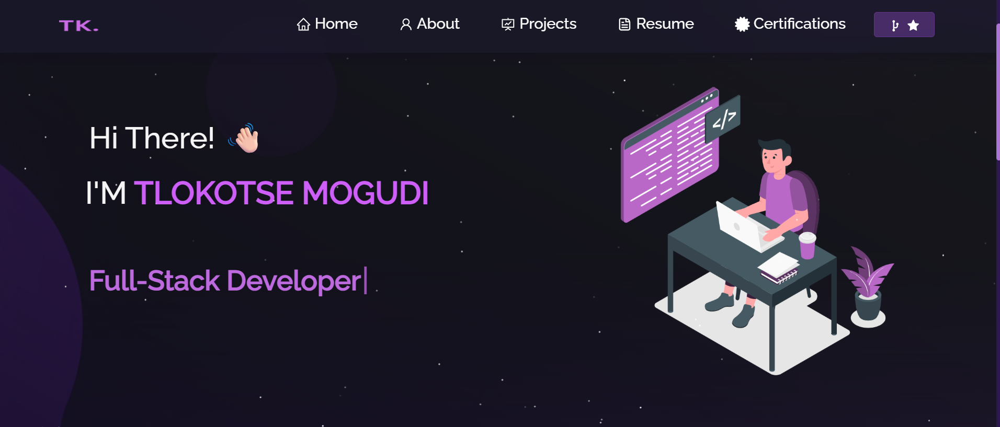

<h2 align="center">
  TK's Portfolio Website<br/>
  <a href="https://github.com/TlokotseSM/Tlokotse-master" target="_blank">tlokotsemogudi.tech</a>
</h2>
<div align="center">
  
</div>

<br/>

<center>

[](https://forthebadge.com) &nbsp;
[](https://forthebadge.com) &nbsp;
[](https://forthebadge.com) &nbsp;
 &nbsp;


</center>

<h3 align="center">
    🔹
    <a href="https://github.com/TlokotseSM/Tlokotse-master/issues">Report Bug</a> &nbsp; &nbsp;
    🔹
    <a href="https://github.com/TlokotseSM/Tlokotse-master/issues">Request Feature</a>
</h3>

## Tk_DeDev

You are welcome to fork this repo and modify it for your own portfolio.  
If you do, please give me proper credit by linking back to [Tlokotse Mogudi](https://github.com/TlokotseSM). Thanks! 🚀

## Built With

My personal portfolio <a href="https://github.com/TlokotseSM/Tlokotse-master" target="_blank">tlokotsemogudi.tech</a> showcases my projects, resume, and technical skills.<br/>

This project was built using these technologies:

- React.js ⚛️
- Node.js
- Express.js
- CSS3 🎨
- VS Code
- Vercel 🚀

## Features

**📖 Multi-Page Layout**  
**🎨 Styled with React-Bootstrap + Custom CSS**  
**📱 Fully Responsive**  

## Getting Started

Clone this repository. You will need `node.js` and `git` installed globally on your machine.

## 🛠 Installation and Setup Instructions

1. Install dependencies:  
   ```bash
   npm install
